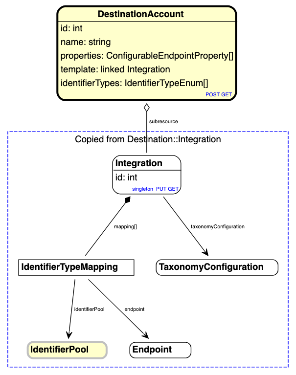

# Diagram definitions

To generate a diagram, add a definition inside one of your .reslang files, specify which definitions should be included.

E.g. the File and Directory API diagram is as follows:

```
diagram files {
    /includeall
        files.reslang
}
```

To generate the dotviz, use a command like the following:

```
yarn reslang models/file --diagram files --open
```

This will open up the online graphviz viewer and copy the dotviz output to the clipboard. Replace the text in the browser with the clipboard text and voila, you have a diagram.


## Advanced Usage

You can customize what is included as fully expanded by using /include. You can control what is included but not expanded using /import. You can exclude elements using /exclude, and finally you can fold association into inline attributes using /fold.

You can also draw any number of groups around elements using the /group command.

```
diagram destinationaccount {
    /includeAll
        destination-account.reslang

    /include
        distribution.IdentifierTypeMapping

    /import
        identity.IdentifierPool
        distribution.Destination::Endpoint
        distribution.Destination::TaxonomyConfiguration

    /exclude
        ConfigurableEndpointProperty

    /fold
        properties of DeliveryInstructions

    /group "Copied from Destination::Integration"
        Integration
        distribution.IdentifierTypeMapping
        identity.IdentifierPool
        distribution.Destination::Endpoint
        distribution.Destination::TaxonomyConfiguration

```


