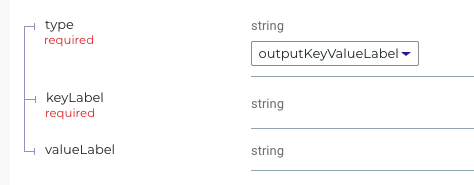

# Direct2Dist API Walkthrough

The Direct2Dist API has been carefully designed to allow clients to deliver to endpoints, if they already know the destination identifiers.

Here is the directory containing the [full specification](../models/direct2dist).

We now present certain parts and explain them.

## Namespace

The namespace for this API is "direct2dist", the name of the directory. In the actual API the namespace is "distribution". The api.reslang file defines the version of the namespace:

```
"API for accessing LiveRamp's Direct to Distribution Service"
namespace {
    title "Direct to Distribution API - BETA "
    version 0.0.1
}
```

Note that any comments between quotes end up on the description element of the Swagger field.

## Resource

The primary resource of this API is the DistributionRequest.

```
request-resource DistributionRequest {
    id: string

      "Reference to a destination's endpoints to be used for distributing the data"
    destinationEndpointId: linked Destination::Endpoint
      "A map of keys and values needed to use the selected destination endpoint"
    destinationEndpointProperties: stringmap<string>
      "URL of the data to be distributed. Currently, we only support files in GCS"
    inputDataURL: url
    ...
```

This is modeled as a resource-request, which means that it involves long running (and generally asynchronous) behavior.

The id field is always mandatory on any element which can be retrieved via id. In this case we have declared it of string type.

Note that the destinationEndpointId is a link to a Destination::Endpoint subresource. This resource has not been fully defined yet, so we declare it as a future resource. This means we won't generate Swagger for it, but can still refer to it.

```
future resource Destination {
    id: int
}

future subresource Destination::Endpoint {
    id: int
}
```

## Operations

In the DistributionRequest resource, the following operations are defined:

```
    /operations
          "Get a request. See docs: DistMVP.GET"
        GET
          "Use this endpoint to create a new DistributionRequest"
        POST
          "Use this endpoint to find existing DistributionRequests. See docs: DistMVP.MULTIGET"
        MULTIGET
```

Note that GET will return all attributes. POST uses all attributes not marked as "output", "synthetic" or id. In other words, if an attribute is output only, you cannot use it to create a resource.

## MULTIGET & queryonly

You'll notice the use of MULTIGET - this is a GET on the resource name, and any attributes marked as "query" or "queryonly" will be used as filter parameters. Queryonly attributes are not real attributes - they exist to define query parameters only. Query attributes are real attributes that also define query parameters.

```
    // query only params
      "Sort key and order. See docs: DistMVP.sort"
    sort: SortTypeEnum queryonly
```

## Actions

Actions are a bit like subresources. They are parented by a top-level request resource - in this case DistributionRequest.

```
"Use this action to cancel a given DistributionRequest. See docs: DistMVP.Cancel"
async action DistributionRequest::Cancel {
    id: string

    /operations
    POST
}
```

You can either put "async" or "sync" in front of the action to indicate if it is long-running or not. If an action is sync, then it completes its operation before returning.

## Stringmap

Reslang supports maps where the key is always a string. Here is an example of a string->string map:

```
    destinationEndpointProperties: stringmap<string>
```

## Unions

Reslang supports discriminated unions.

```
union MappingOutputUnion {
    outputKeyValueLabel: MappingKeyValueLabel
    outputIdLabel: MappingIdLabel
}

structure MappingKeyValueLabel {
    keyLabel: string
    valueLabel: string optional
}

structure MappingIdLabel {
    idLabel: string
}
```

The discriminator will always be a string field called "type". The possible values of type will be the names of the attributes - "outputKeyValueLabel" and "outputIdLabel".

The ReDoc view of the above structure is below. You can clearly see that keyLabel and valueLabel are at the union level now, rather than a reference to the MappingKeyValueLabel structure.


