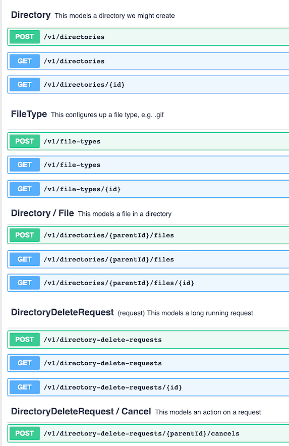

# Tutorial Introduction - File and Directory API

Here is an example of a simple API for creating and manipulating files and directories.

(NOTE: we've used a lot of features below to illustrate them, but it tends to make the example a bit more complex than it would otherwise be...)

First, the paradigm. There are 3 different resource types in Reslang, and they each live in a namespace. e.g. /file

-   a **configuration-resource** describes configuration in the system.
-   an **asset-resource** is a resource that is typically created by processing data through our system.
-   a **request-resource** is an asynchronous, long running process modeled as a resource.

Each resource specifies the attributes it holds, followed by the possible operations / verbs. The reason for the three different types is that they will eventually have different audit and ownership structures - e.g. we might have full history available for configuration resources.

## The API

Without further ado, here is the [API in reslang](../models/file):

```
"This is a simple API for manipulating files"
namespace {
	title "API for modeling directories and files"
	version 1.0.0
}

"This models a directory we might create"
asset-resource Directory {
	id: string query
	name: string query
	/operations
        GET POST MULTIGET
}

"This configures up a file type, e.g. .gif"
configuration-resource FileType {
	id: string
	type: string query
	format: string
	specId: linked Specification
	/operations
		"Get a FileType"
		GET
			"Cannot find file type" 404
			"Not Allowed" 405
				StandardError
			"Forbidden" 403
				SpecialError
		POST
		MULTIGET
}

future configuration-resource Specification {
	id: string
}

"This models a file in a directory"
subresource Directory::File {
	id: int
	name: string
	url: string
	fileTypeId: linked FileType

	contents: string queryonly

    /operations
        GET POST MULTIGET
}

"This models a long running request"
request-resource DirectoryDeleteRequest {
	id: int query
	directoryId: linked Directory

    /operations
        GET POST MULTIGET
}

"This models an action on a request"
sync action DirectoryDeleteRequest::Cancel {
	id: int

    /operations
		POST
}

"A non-standard error response"
structure SpecialError {
	message: string
	time: datetime
}
```

## Explanation

The namespace declaration at the top defines the API for the entire namespace and versions it. Note that the namespace name is the folder name that the file is contained in - in this case /file

We model a Directory as an asset-resource. We can create any number of directories via POST. Files are contained within these directories, represented by the Directory subresource named File. Each File refers to a configuration-resource of FileType (e.g. png) via the "linked" keyword.

Finally, we have a request for deleting a directory, assuming this is a long running (async) task. You can further perform a cancel action on it, to stop its operation. We could have also modeled this deletion by adding DELETE to the operations on Directory.

To create the Swagger, type the following, assuming that the file(s) live in a directory called "./file" and have the extension of .reslang:

​ `reslang ./file --open`

This copies the swagger to the clipboard (& opens the Swagger editor in the browser, allowing you to paste the clipboard into it).

To generate a diagram we must specify a diagram specification:

```
diagram files {
    /includeAll
        files.reslang
}
```

Then we type the following:

​ `reslang ./file --diagram files --open`

This copies the dotviz to the clipboard (and opens the Dotviz viewer in the browser, allowing you to paste the clipboard into it).

## Example Swagger Output

The Swagger looks as follows in the Swagger Editor - the top level API description reflects the namespace declaration. (Note that the Reslang API descripotion is 48 lines, whereas the Swagger is 440+ lines)


The Swagger itself reflects the set of routes available. Note that any quoted text just before an element gets inserted as documentation into the Swagger.



Generating a dotviz file creates the following diagram of the API:


Top level resources are yellow. Links from one resource to another are shown via arrows.

## Extended Example

Please see [this page](./direct2dist-explanation.md) for a real-life example, explaining the [Direct2Dist API](../models/direct2dist).
