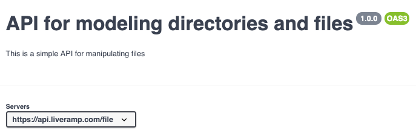

# Reslang - A DSL for Creating Resource-Oriented APIs

Reslang (aka Resource Language) is a fast and expressive way to create resource-oriented Swagger API definitions.

You can think of it as a Domain Specific Language for creating APIs, specifically tailored for the LiveRamp environment. The Swagger output produced automatically conforms to the documented [LiveRamp API standards](https://docs.google.com/document/d/1HHkdHXVj8vQ4XLKlmwD5QggV0lTg08_tI9J_tF5Qe9Q/edit?usp=sharing).

## Key Advantages Over Swagger

Why use Reslang when Swagger is clearly more expressive? There are a few reasons:

-   Reslang is far more concise & preserves the intent of the API creator better
    -   Reslang describes APIs in a higher-level, more succinct way, allowing for preservation of intent. When working directly with Swagger, it is easy to get stuck on the details, particularly when reviewing and commenting. It is common that the Reslang file is one-fifth the size of the Swagger equivalent.
    -   Reslang specifies how versioning works. Swagger, on the other hand, expresses no opinion on API or resource versioning, or the different classification of resources.
    -   Reslang enforces a resource perspective. Swagger itself expresses no preference, and API creators can easily default to RPC.
-   Reslang guarantees full conformance with our API spec

## Features

Reslang elevates the description of your API to a higher level of abstraction.

-   It allows description of resources, classified into asset, configuration and request - mirroring our own domain classifications.
-   A Java-like syntax makes it very fast and intuitive to write specs.
-   Full support for subresources, singletons, structures, enums, linkage from one resource to another, arrays. Maps and enums will be done soon .
-   Create Swagger or a diagram from your Reslang spec.

## The basics: Resources and Namespaces

There are 3 different resource types in Reslang:

-   a **configuration-resource** describes configuration in the system.
-   an **asset-resource** is a resource that is typically created by processing data through our system.
-   a **request-resource** is an asynchronous, long running process modeled as a resource.

Each resource specifies the attributes it holds, followed by the possible operations / verbs. The reason for the three different types is that they will eventually have different audit and ownership structures - e.g. we might have full history available for configuration resources.

Each API lives in a namespace, e.g. /distribution/... the API for each namespace lives in its own directory, which can contain many reslang files.

## Example - File and Directory API

Here is an example of a simple API for creating and manipulating files and directories:

(NOTE: we've used a lot of features below to illustrate them, but it makes the example a bit more complex...)

```
"This is a simple API for manipulating files"
namespace {
	title "API for modeling directories and files"
	version 1.0.0
}

"This models a directory we might create"
asset-resource Directory {
	id: string query
	name: string query
	/operations
        GET POST MULTIGET
}

"This configures up a file type, e.g. .gif"
configuration-resource FileType {
	id: string
	type: string query
	format: string
	specId: linked Specification
	/operations
		"Get a FileType"
		GET
			"Cannot find file type" 404
			"Not Allowed" 405
				StandardError
			"Forbidden" 403
				SpecialError
		POST
		MULTIGET
}

future configuration-resource Specification {
	id: string
}

"This models a file in a directory"
subresource Directory::File {
	id: int
	name: string
	url: string
	fileTypeId: linked FileType

	contents: string queryonly

    /operations
        GET POST MULTIGET
}

"This models a long running request"
request-resource DirectoryDeleteRequest {
	id: int query
	directoryId: linked Directory

    /operations
        GET POST MULTIGET
}

"This models an action on a request"
sync action DirectoryDeleteRequest::Cancel {
	id: int

    /operations
		POST
}

"A non-standard error response"
structure SpecialError {
	message: string
	time: datetime
}
```

The namespace declaration at the top defines the API for the entire namespace and versions it. Note that the namespace name is the directory name.

The API models a Directory as an asset-resource. We can create any number of directories via POST. Files are contained within these directories, represented by the Directory subresource named File. Each File refers to a configuration-resource of FileType (e.g. png) via the "linked" keyword.

Finally, we have a request for deleting a directory, assuming this is a long running task. You can further perform a cancel action on it, to stop its operation. We could have also modeled this deletion by adding DELETE to the operations on Directory.

To create the Swagger, type the following, assuming that the file(s) live in a directory called "./file" and have the extension of .reslang:

​ `reslang ./file --open`

This copies the swagger to the clipboard (& opens the Swagger editor in the browser, allowing you to paste the clipboard into it).

To generate a diagram we must specify a diagram specification:

```
diagram files {
    /includeall
        files.reslang
}
```

Then we type the following:

​ `reslang ./file --diagram files --open`

This copies the dotviz to the clipboard (and opens the Dotviz viewer in the browser, allowing you to paste the clipboard into it).

## Example Swagger Output

The Swagger looks as follows in the Swagger Editor - the top level API description reflects the namespace declaration. (Note that the Reslang API descripotion is 48 lines, whereas the Swagger is 445 lines)



The Swagger itself reflects the set of routes available. Note that any quoted text just before an element gets inserted as documentation into the Swagger.


Generating a dotviz file creates the following diagram of the API:


Top level resources are yellow. Links from one resource to another are shown via arrows.

## Reference Manual

### Resource types

The 3 resource types are "configuration-resource", "asset-resource" and "request-resource". Each resource can have any number of 1-level-deep subresources. Deeper levels are not supported.

You can use the "singleton" keyword before a resource definition to indicate there is only 1 instance of this resource.

### Primitive Types

The following primitive types are available. These are translated into appropriate Swagger types - in some cases (datetime etc) the primitive type is translated into a string type because Swagger has no notion of time-based values. If a translation occurs, then an appropriate comment / example text will be inserted as documentation

| Type     | Description                                                                   |
| -------- | ----------------------------------------------------------------------------- |
| int      | 32-bit integer                                                                |
| string   | Standard string                                                               |
| double   | Double floating point                                                         |
| boolean  | True or false                                                                 |
| date     | Date in ISO8601 format (2019-04-13)                                           |
| time     | Time in ISO8601 format (22:00:01)                                             |
| datetime | Date+time in ISO8601 format, always with timezone<br />(2019-04-13T03:35:34Z) |
| url      | A URL                                                                         |

### Versioning

Granular versioning is possible on toplevel resources and other elements, but is not possible (or necessary) for subresources. By default all definitions are v1 if not specified. However, we can place another version at the front to indicate a breaking change in the resource e.g. v2/resource.

Note that this can also inherit from the v1 resource. We do not need more than the major version in the semver, as the assumption is that if you introduce minor changes in a resource it will be backwards compatible.

Also note that it is perfectly possible to support multiple major versions of a resource in a single API.

An example of evolution is contained in the models/new/upversion directory:

```upversioning example
asset-resource v2/ResourceB {
  id: int
  totalSize: int

  /operations
    POST GET
}

subresource v2/ResourceB::Sub {
  id: int
  name: string

  /operations
    POST GET
}
```

### Imports & Directory Structure

The directory structure is "namespace/\*.reslang". You can import another namespace at the peer level into your current file using "import othernamespace". You should then refer to the imported elements by their full name "othernamespace.Resource".

```
import identity

asset-resource Test {
  poolId: linked identity.IdentityPool
  ... }
```

### Id

Currently the primary id field of any resource needs to be called "id". You only require an id for (sub)resources that are not singleton and have a PUT or DELETE operation.

### Error Codes and Responses

You can specify a set of error codes and bodies after each operation. The following example shows a response for 404, 405 and 403 error codes.

```Error code example
configuration-resource FileType {
	id: string
	type: string
	format: string
	spec: linked Specification
	operations
		"Get a FileType"
		GET
			"Cannot find file type" 404
			"Not Allowed" 405
				StandardError
			"Forbidden" 403
				SpecialError
		POST
		MULTIGET type id
}
```

Note that StandardError is an internally defined structure that should be used for most errors. SpecialError above shows that you can also define your own error bodies as structures.

### Future Resources

It's common, when defining an API, to want to refer to resources that haven't yet been created. The "future" keyword allows you to define a theoretical resource, which will generate no Swagger. The purpose of this is so you can do a "linked" reference to it, in the expectation that you will add the full resource in the future.

```Future resource
future configuration-resource Specification {
	id: string
}
```

### Links

To refer to one resource from another, used the "linked" keyword in front of the attribute type.

### Structures

You can define as reusable set of attributes using the "structure" keyword. The systax is like a resource but it does not support operations or the singleton modifier.

### Arrays

Use [] after an attribute type to indicate an array.

### Enums

You can define a set of literals using the "enum" keyword.

### API Spec

Use the "namespace" keyword to indicate the title and version of an API. There should only be one API spec per directory.

### 2 types of comments

// && /\* \*/ comments are developer only comments. A comment using quotes ("this is a comment") will get transferred to the Swagger description field of the element it appears before.

### Multiget

A multi-GET is a GET on the plural resource, returning a collection of resources. Currently at least 1 filter parameter needs to be specified after the MULTIGET.

## Currently Unsupported

-   Maps & Unions
-   Attribute & model examples
