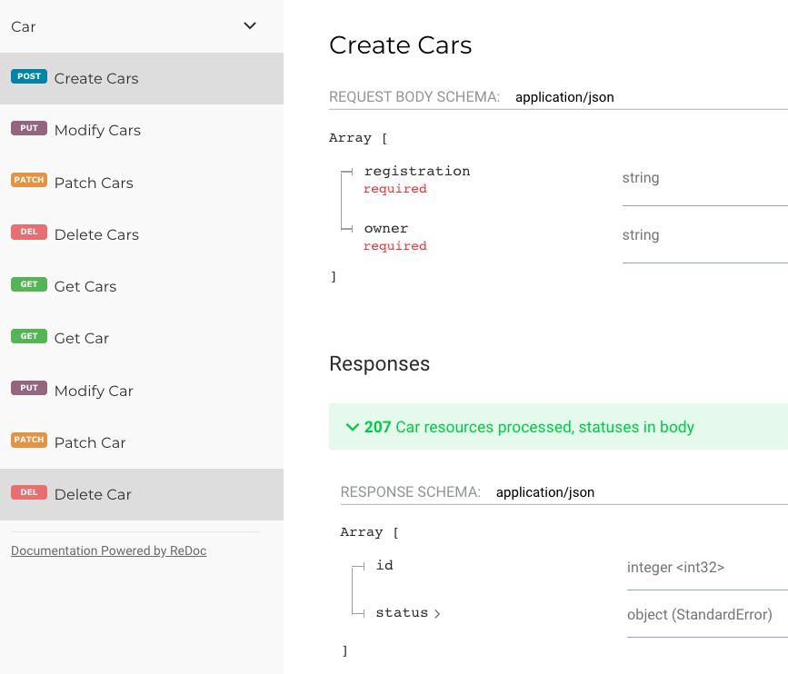

# The Reslang Paradigm for API Creation

## Resource Oriented & Automatic Standards

Reslang provides an opinionated, resource oriented approach to APIs. In this paradigm, you have resources (and subresources) on the server and you can perform operations on them via the REST verbs - the famous uniform interface. i.e.you can GET a resource, use POST to create, PUT & PUT to update, and DELETE to delete.

Why is our approach opinionated? Well, it biases away from HATEOAS towards a simpler more pragmatic view. References to other resources are represented by ids, rather than links. It also allows you to drop down into an OO paradigm of custom verbs / actions. Finally it enforces our standards on APIs, which are documented [here](./docs/LiveRampAPIStandards.pdf) - diverging from these is intentionally difficult simply because reslang encodes the standards automatically, you never need to even be concerned with them.

## The Getout Clause: Escaping from Pure Resources

The full vision of REST implies that applications hold state and push it down to servers as resources. However, in our experience, there are always times when the server has a set of long running requests, some of them asynchronous, that we need to model.

Reslang contains 2 concepts to handle this - actions and request-resources.

Actions are basically custom verbs, modeled as subresources on a parent resource, and they can be both synchronous and asynchronous.

Request-resources in contrast are always toplevel resources, with no parent, which are always considered to be asynchronous.

We term this 'resourcification' - the action of turning a request or action into a resource. Note that both normal resources and request-resources can have actions.

Let's reconsider our simple File intro example [here](intro.md). Here's the part that deals with deleting directories:

```
"This models a long running request"
request-resource DirectoryDeleteRequest {
	id: int query
	directoryId: linked Directory
    finished: boolean

    /operations
        GET POST MULTIGET
}

"This models an action on a request. It can be sync or async"
sync action DirectoryDeleteRequest::Cancel {
	id: int

    /operations
		POST
}
```

You'll note that DirectoryDeleteRequest is a request-resource. You create it via POST, and it returns 201. At this point the request has been received and is being processed in the background. You can then GET its representation and look to see if it has finished.

In some cases, actions are appropriate to model custom verbs. In this case we have provided an action to cancel a DirectoryDeleteRequest, rather than using DELETE (which removes the record of the resource). The action is synchronous, so when it returns from the POST with a 200, you know that the DirectoryDeleteRequest has been canceled, but it can still be queried as it has not been canceled. If it were async instead, it would return 202 if the action had been accepted but is not yet complete. Alternatively it might return 200 (if the action was complete upon return) or 204 if the action had already been submitted and was underway.

## Reslang/REST versus OO versus RPC

So, our paradigm is essentially nested resources, which you operate on using HTTP verbs.

We further allow resources to have actions (which themselves are just subresources), which makes this an object oriented paradigm if you choose to use this facility.

Contrast REST versus Reslang versus OO versus RPC:

| Paradigm        | Meaning                                                                     |
| --------------- | --------------------------------------------------------------------------- |
| Standard REST   | N nouns/resources, a fixed set of HTTP verbs                                |
| Reslang         | Standard REST, plus actions and request-resources for modeling custom verbs |
| Object oriented | N nouns, M methods (no uniformity)                                          |
| RPC             | 1 noun (the broker), X methods (no resources, no uniformity)                |


## Bulk Operations

Reslang also provides batch/bulk version of the standard HTTP verbs. These basically take (or return) an array of the contents of the normal verbs. You can mix and match the batch and standard verbs, with the exception that you cannot have both POST and MULTIPOST because they occupy the same URL.

Here's an example, along with the appropriate Swagger UI view. The MULTPOST accepts an array of Car representations (without id) and returns an array of Error responses indicating the success of each Car creation.

```
resource Car {
    id: int
    registration: string
    owner: string

    /operations
        MULTIPOST
        GET MULTIGET
        PUT MULTIPUT
        PATCH MULTIPATCH
        DELETE MULTIDELETE
}
```

This creates the following ReDoc view - we've selected MULTIPOST so you can see the inputs and outputs:



## Bulk Actions

A bulk action looks like it lives as a subresource, but really it requires no resource.

Here is a simple example:

```
sync bulk action DeliverPurchasedSegments::search {
    id: string
    name: string query
    /operations
        MULTIGET
}
```

Here we create an action "search" on DeliverPurchasedSegments. It looks like a subresource, but it actually lives at the toplevel - in this example it searches segments using parameters. The URL is /v1/deliver-purchased-segments/actions/search and calling MULTIGET allows you to specify a way to search segments.


